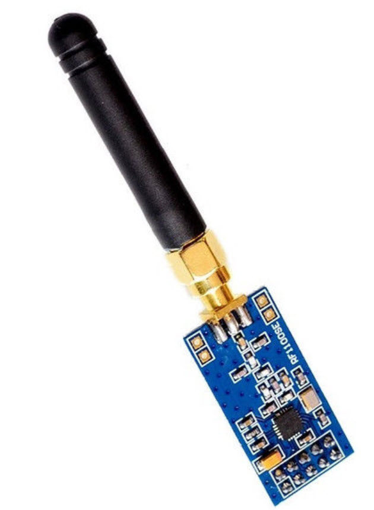
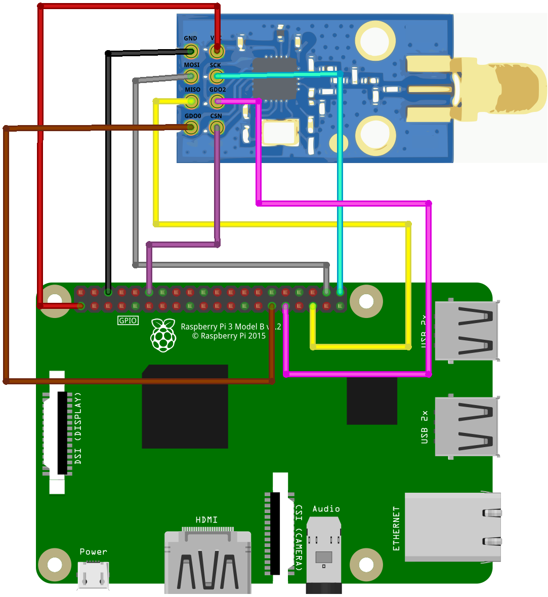

# How to record an RF signal with GNURadio and transmit it using a CC1101

This code can be used to copy and send a 433 MHz signal. The signal source is a garage key fob, as these signals don't have encryption and its modulation is simple (ASK).

## CC1101 Wireless Module

  

## Rasnpberry Pi 3 and CC1101 Wireless Module connections

  

For more info: www.behindthesciences.com

https://behindthesciences.com/electronics/how-to-record-an-rf-signal-with-gnuradio-and-transmit-it-using-a-cc1101/
